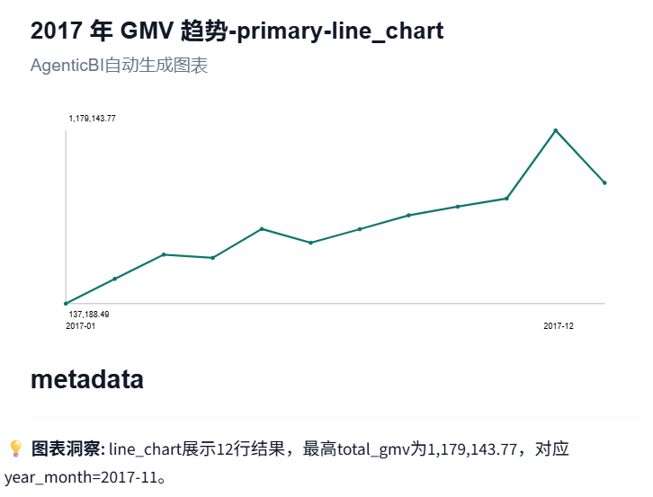
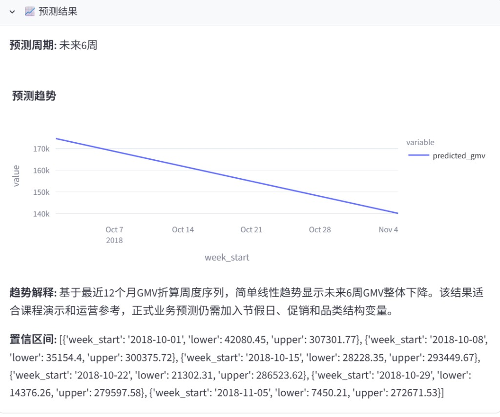
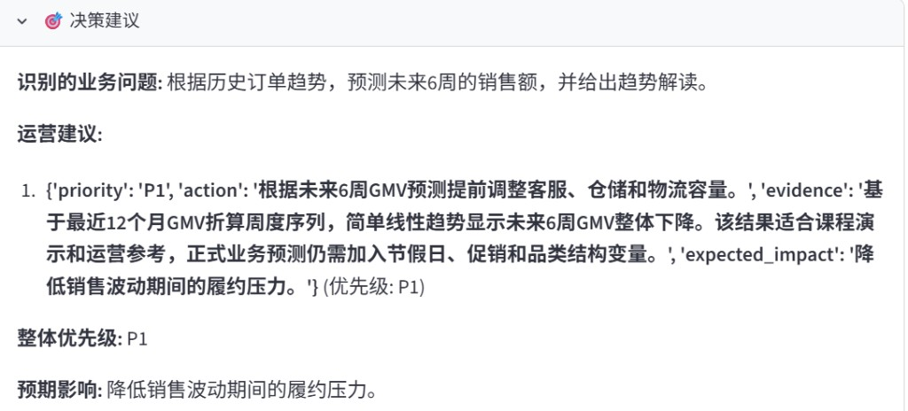

| 项目信息 | 内容 |
| --- | --- |
| 数据集 | Brazilian E-Commerce Public Dataset by Olist |
| 小组人数 | 4 人 |
| 报告日期 | 2026 年 6 月 |


---

## 摘要
本项目基于 Olist 巴西电商公开数据集，设计并实现了一套**多智能体协作的 Agentic BI 分析系统**。系统以 MySQL 为查询引擎，通过六张预聚合视图（`mv_*`）加速高频分析查询；以 LangGraph 编排协调器、数据分析、可视化、NLP 评论洞察、决策智能与 What-if 等 Agent，使非技术业务人员能够用自然语言提问，并获得跨表统计分析、预测图表与可执行的运营建议。

系统完整覆盖课程要求的**描述性、诊断性、预测性、规范性**四层分析，支持不少于六类可视化图表，并提供 Streamlit + FastAPI 双栏 Web 交互界面。经性能对比实验验证，预聚合路径相较基表多表 JOIN 可将查询耗时降低约三个数量级。

---

## 目录
1. 项目背景与动机
2. 关键技术选型说明
3. 数据集描述与预处理
4. 系统架构设计
5. 预聚合视图设计
6. 多智能体实现与调度方法
7. 四层分析能力与运行结果
8. 可视化与 Web 界面
9. 技术挑战与解决方案
10. 小组分工与贡献比例
11. 总结与展望

---

## 1. 项目背景与动机
### 1.1 从传统 BI 到 Agentic BI
随着大语言模型（LLM）与多智能体技术的成熟，商业智能（BI）正从「被动看板」进化为「主动分析与决策引擎」——这便是 **Agentic BI** 的核心思想。传统 BI 依赖分析师手工编写 SQL、制作图表并撰写报告，响应周期长，且难以覆盖跨表、多维度、文本与预测等异质分析任务。

本项目要求基于**真实多表电商数据集**，构建一套能够：

+ 理解自然语言业务问题；
+ 自动完成跨表数据查询与多维度统计分析；
+ 生成预测与可视化图表；
+ 给出具有决策价值的规范性建议。

的多智能体 BI 系统，从而深入理解 Agentic BI、决策智能（Decision Intelligence）与 AI 原生 BI 架构等前沿概念。

### 1.2 业务角色与核心任务
**假设角色**：本组扮演巴西跨境电商平台 Olist 的**数据科学与决策支持顾问**。

**核心任务**：构建 Agentic BI 系统，让运营、市场等非技术人员用自然语言提问，即时获得**分析结论、可视化图形与可执行商业建议**，支撑从「看数据」到「做决策」的闭环。

### 1.3 项目主要创新点
| 创新点 | 说明 |
| --- | --- |
| 预聚合加速层 | 六张 `mv_*` 物理表，Agent 优先命中、无法覆盖时回退基表 |
| 多 Agent 协作 | LangGraph StateGraph 编排 10 个节点，结构化传递中间结果 |
| 四层分析闭环 | 描述 → 诊断 → 预测 → 规范性建议，NLP 与 What-if 融入决策 |
| 自然语言交互 | Streamlit 双栏界面 + 多轮对话记忆，降低使用门槛 |


---

## 2. 关键技术选型说明
### 2.1 技术栈总览
| 层次 | 技术选型 | 选型理由 |
| --- | --- | --- |
| 大语言模型 | 智谱 GLM-4.7-Flash（API） | 支持 JSON 结构化输出，中文理解好，部署成本低 |
| Agent 编排 | LangGraph（StateGraph + MemorySaver） | 有状态任务图、条件分支、对话记忆，适合异质 Agent 协作 |
| 查询引擎 | MySQL 8.x | 课程指定；基表与预聚合表同库，Agent 生成 SQL 即可 |
| 后端 API | FastAPI | 异步、自动 Swagger 文档，便于前后端分离 |
| 前端界面 | Streamlit 1.30+ | 快速搭建对话 + 可视化双栏，适合演示与答辩 |
| 图表渲染 | Plotly 5.x + wordcloud | 交互式图表 + 词云，满足六类可视化要求 |
| 预测模型 | Holt 线性指数平滑（基于 `mv_monthly_sales`） | 样本仅 24 个月，网格搜索 α/β，可解释且依赖轻 |
| NLP 情感分析 | 基于 `review_score` 规则 + 关键词统计 | 口径清晰、可复现，无需额外葡语训练语料 |
| 数据处理 | pandas + SQLAlchemy + pymysql | 清洗流水线与数据库导入成熟稳定 |


### 2.2 LLM 接入方式
LLM 配置集中于 `config/settings.py`，通过 `.env` 管理 API Key 与模型参数，默认：

+ Provider：`zhipu`
+ Model：`glm-4.7-flash`
+ Temperature：`0.2`（降低 SQL 生成随机性）

数据分析 Agent 通过 `agents/llm_client.py` 封装文本与 JSON 两种调用模式；协调器、决策 Agent 等共用同一客户端，保证接口一致。

### 2.3 Agent 框架选型
鉴于本项目涉及**多表 SQL 查询、文本分析、时间序列预测、假设模拟**等异质任务，采用 **LangGraph** 构建有状态编排图：

+ 各 Agent 执行函数定义为 StateGraph **节点**；
+ **条件边**控制预测、NLP、What-if 等模块是否执行；
+ **共享状态字典**（`BIAnalysisState`）传递中间结果；
+ **MemorySaver** 支持多轮对话上下文（加分项）。

### 2.4 查询引擎选型
本项目采用 **MySQL 8.x**（库名 `olist_agentic_bi`）作为查询引擎，主要因为作业指定 MySQL，且九张基表与六张 `mv_*` 预聚合表可同库部署。数据分析 Agent 通过 SQLAlchemy + pymysql 执行只读 SQL，并遵循「优先查 `mv_*`、无法覆盖时回退基表」的策略（详见 §5）。

### 2.5 预测模型选型
预测模块位于 `models/forecast_model.py`，基于 `mv_monthly_sales` 的月度 GMV 序列，采用 **Holt 线性指数平滑**（`holt_linear_exponential_smoothing`）外推未来 6 周，并给出近似 95% 置信区间。建模前会剔除启动期低 GMV 月份与结尾不完整月份；作业虽建议 Prophet、ARIMA、LSTM 等模型，但 Olist 仅约 24 个月样本，复杂模型易过拟合；Holt 方案可解释、依赖少，足以支撑课程要求的预测性分析与决策建议（运行结果见 §7.3）。

---

## 3. 数据集描述与预处理
### 3.1 数据来源与规模
本项目采用 Kaggle 公开数据集 **Brazilian E-Commerce Public Dataset by Olist**（巴西 Olist 电商平台交易数据）。数据覆盖 **2016 年 9 月至 2018 年 10 月** 的真实订单链路，包含 **9 张独立业务表**，通过 `order_id`、`customer_id`、`product_id`、`seller_id` 等字段关联。

经本组清洗后入库的数据规模如下：

| 表名 | 清洗后行数 | 主要用途 |
| --- | --- | --- |
| orders | 99,441 | 订单主表、时间轴、配送时效 |
| order_items | 112,650 | 价格、运费、GMV 计算 |
| customers | 99,441 | 客户地域、去重用户数 |
| products | 32,951 | 品类、商品属性 |
| sellers | 3,095 | 卖家地域与绩效 |
| payments | 103,886 | 支付方式、分期 |
| order_reviews | 99,067 | 评分与评论文本（供 NLP Agent） |
| geolocation | 720,154 | 邮编前缀与经纬度（地图可视化） |
| product_category_name_translation | 71 | 葡语品类 → 英语品类 |


### 3.2 表间逻辑关系
+ **orders** ↔ **order_items**：一对多（一单多行明细）
+ **orders** ↔ **customers**：多对一
+ **order_items** ↔ **products** / **sellers**：多对一
+ **orders** ↔ **payments** / **order_reviews**：一对多
+ **products** ↔ **product_category_name_translation**：品类名翻译
+ **customers** / **sellers** ↔ **geolocation**：通过邮编前缀近似关联地理坐标

### 3.3 分析口径约定
为便于 Agent 与预聚合层一致，本组在 `config/data_dictionary.yaml` 中统一约定：

| 指标 | 口径 |
| --- | --- |
| GMV（成交总额） | `order_items` 层 `SUM(price + freight_value)` |
| 准时送达 | `order_delivered_customer_date <= order_estimated_delivery_date`；仅统计具备完整时间戳的订单 |
| 时间轴 | 趋势分析默认以 `orders.order_purchase_timestamp` 为准 |


### 3.4 数据预处理步骤
预处理脚本：`utils/data_cleaning.py`

```plain
Kaggle 原始 CSV (data/raw/)
        ↓  data_cleaning.py
清洗后 CSV (data/clean/)
        ↓  db_init.py
MySQL 基表 + mv_* 预聚合表
```

**各表主要清洗规则：**

| 表 | 主要处理 |
| --- | --- |
| orders | 主键与状态去空格；5 个时间列转 datetime；按 `order_id` 去重 |
| order_items | 数值列转 numeric、缺失填 0；按 `(order_id, order_item_id)` 去重 |
| customers / sellers | 字符串 strip；按主键去重 |
| products | 保留 Kaggle 原版 `*_lenght` 列名；数值属性转 numeric |
| payments | 分期、序号、金额转数值；按复合键去重 |
| order_reviews | 评分转整型；评论 strip；时间列转 datetime |
| geolocation | 剔除无效坐标；按 `(zip_prefix, lat, lng)` 去重 |
| product_category_name_translation | 葡/英品类名 strip |


**缺失值与异常值策略：**

+ 时间字段无法解析 → `NULL`，不参与依赖该时间的聚合；
+ 金额缺失 → 按 0 处理，避免 SUM 出现 NaN；
+ 地理坐标非法 → 删除该行；
+ 重复行 → 按业务主键 `drop_duplicates(keep='first')`。

**复现命令：**

```bash
pip install -r requirements.txt
python utils/data_cleaning.py
python utils/db_init.py
```

### 3.5 数据库表结构
+ **数据库名**：`olist_agentic_bi`（可通过环境变量覆盖）
+ **字符集**：`utf8mb4`（支持葡语评论）
+ **DDL 脚本**：`utils/schema_ddl.sql`
+ **数据字典**：`config/data_dictionary.yaml`（面向 Agent / NL2SQL 的字段说明与业务口径）

DDL 中未强制声明外键约束，便于批量导入；逻辑关联由 Agent 生成的 SQL 保证。

---

## 4. 系统架构设计
### 4.1 整体分层架构
<!-- 这是一张图片，ocr 内容为： -->


_图 4.1：自顶向下依次为 Streamlit 交互层、FastAPI 接口层、LangGraph Agent 编排层、预测/NLP/What-if 模型层与 MySQL 数据层（基表 + 预聚合视图）_

### 4.2 系统综合架构（Agent 流程 + 预聚合加速层）
<!-- 这是一张图片，ocr 内容为： -->


_图 4.2：左侧为 LangGraph 多 Agent 协作主流程；右侧为 MySQL 两层数据结构——上方 __**Pre-Aggregation 预聚合加速层**__（六张 _`mv_*`_ 表），下方 __**九张业务基表**__。数据分析 Agent 通过 __**绿色实线**__ 优先查询预聚合视图；当问题维度无法被 _`mv_*`_ 覆盖时，经 __**橙色虚线**__ 回退至基表多表 JOIN_

**架构要点：**

| 组件 | 说明 |
| --- | --- |
| 预聚合加速层 | 由 `utils/pre_aggregation.sql` 离线构建，供 Agent 高频查询 |
| 数据分析 Agent | 承担 NL→SQL 与视图路由，是连接 Agent 层与数据层的枢纽 |
| 优先 / 回退策略 | 在 `prompts.yaml` 与 `data_analysis_agent.py` 中通过视图覆盖校验强制执行 |
| 下游 Agent | forecast / NLP / visualization / decision 消费数据分析结果，不直接访问数据库 |


### 4.3 核心设计理念
1. **分治思想**：每个 Agent 专职一项职责，通过 TypedDict Schema 通信；
2. **预聚合优先**：高频维度问题优先命中 `mv_*`，提升响应速度；
3. **多级容错**：LLM 生成 SQL → 六层校验 → 执行失败自动修复 → 确定性兜底；
4. **结构化传递**：`package_downstream_node` 生成统一 JSON payload 供下游 Agent 消费。

### 4.4 LangGraph 多 Agent工作流
<!-- 这是一张图片，ocr 内容为： -->


_图 4.4：用户提问经协调器与数据分析 Agent 处理后，按问题类型条件触发 forecast / nlp_review / what_if 分支，再汇总至可视化、决策与最终回答。_

### 4.5 智能体角色一览
| Agent | 文件 | 核心职责 |
| --- | --- | --- |
| 协调器 Agent | `agents/coordinator_agent.py` | 意图分类（descriptive/diagnostic/predictive/prescriptive）、任务拆解 |
| 数据分析 Agent | `agents/data_analysis_agent.py` | NL→SQL、视图路由、查询执行、统计摘要 |
| 可视化 Agent | `agents/visualization_agent.py` | 根据字段自动选图，生成图表文件 |
| NLP 评论洞察 Agent | `agents/nlp_review_agent.py` | 情感分析、关键词/主题提取 |
| 决策智能 Agent | `agents/decision_agent.py` | 综合推理，输出分级运营建议 |
| What-if Agent | `agents/what_if_agent.py` | 假设模拟（加分项） |
| 编排器 | `agents/orchestrator_agent.py` | LangGraph 图定义与节点调度 |


---

## 5. 预聚合视图设计
### 5.1 设计动机
Olist 九表关联查询在 Agent 高频调用场景下，若每次对 `orders` JOIN `order_items` 等基表做实时聚合，将产生数万行级中间结果，响应延迟明显。作业要求预先创建 **Pre-Aggregation 加速层**；本项目在 MySQL 中以物理表 `mv_*` 实现（MySQL 无原生物化视图时的等价方案），由 `utils/pre_aggregation.sql` 一次性计算写入，可通过 `db_init.py` 刷新。

### 5.2 六张预聚合表
| 视图名 | 粒度 | 核心指标 | 典型问题 |
| --- | --- | --- | --- |
| mv_monthly_sales | 年-月 | total_gmv, total_orders, avg_basket, total_freight | 月度 GMV 趋势、环比 |
| mv_state_sales | 年-月 × 客户州 | total_gmv, total_orders, unique_customers | 各州销售排名、区域对比 |
| mv_category_sales | 年-月 × 英语品类 | total_gmv, total_orders, avg_price | 品类结构、Top 品类 |
| mv_delivery_perf | 年-月 × 客户州 | avg_delivery_days, on_time_rate, delayed_orders | 配送延迟、准时率 |
| mv_seller_perf | 年-月 × 卖家 | total_gmv, total_orders, avg_review_score | 卖家绩效、高差评卖家 |
| mv_payment_dist | 年-月 × 支付类型 | total_transactions, avg_installments, total_value | 支付偏好、平均分期 |


**GMV 计算**：各视图均基于 `order_items` 的 `price + freight_value` 汇总，与 `data_dictionary.yaml` 中 `gmv_definition` 一致。

**月份键字段**：统一为 `` `year_month` ``（格式 `%Y-%m`），建表与查询时需使用反引号转义（MySQL 保留词冲突）。

#### 5.2.1 视图 SQL 定义（节选）
每张预聚合表均采用 **DROP → CREATE → INSERT** 三步构建。以下给出两张代表性视图的完整 SQL；其余四张定义同 `utils/pre_aggregation.sql`，粒度与字段结构见上文 §5.2 表格。

**示例一：mv_monthly_sales（月度销售汇总）**

```sql
DROP TABLE IF EXISTS mv_monthly_sales;
CREATE TABLE mv_monthly_sales (
  `year_month` CHAR(7) NOT NULL,
  total_gmv DECIMAL(18,2) NOT NULL,
  total_orders INT NOT NULL,
  avg_basket DECIMAL(18,2) NOT NULL,
  total_freight DECIMAL(18,2) NOT NULL,
  PRIMARY KEY (`year_month`)
) ENGINE=InnoDB DEFAULT CHARSET=utf8mb4;

INSERT INTO mv_monthly_sales (
  `year_month`, total_gmv, total_orders, avg_basket, total_freight
)
SELECT DATE_FORMAT(o.order_purchase_timestamp, '%Y-%m') AS `year_month`,
       SUM(oi.price + oi.freight_value) AS total_gmv,
       COUNT(DISTINCT o.order_id) AS total_orders,
       SUM(oi.price + oi.freight_value) / NULLIF(COUNT(DISTINCT o.order_id), 0) AS avg_basket,
       SUM(oi.freight_value) AS total_freight
FROM orders o
JOIN order_items oi ON o.order_id = oi.order_id
WHERE o.order_purchase_timestamp IS NOT NULL
GROUP BY 1;
```

**示例二：mv_payment_dist（支付方式分布）**

```sql
DROP TABLE IF EXISTS mv_payment_dist;
CREATE TABLE mv_payment_dist (
  `year_month` CHAR(7) NOT NULL,
  payment_type VARCHAR(48) NOT NULL,
  total_transactions INT NOT NULL,
  avg_installments DECIMAL(12, 4) NOT NULL,
  total_value DECIMAL(18,2) NOT NULL,
  PRIMARY KEY (`year_month`, payment_type),
  INDEX idx_pay_ym (`year_month`)
) ENGINE=InnoDB DEFAULT CHARSET=utf8mb4;

INSERT INTO mv_payment_dist (
  `year_month`, payment_type, total_transactions, avg_installments, total_value
)
SELECT DATE_FORMAT(o.order_purchase_timestamp, '%Y-%m') AS `year_month`,
       pay.payment_type,
       COUNT(*) AS total_transactions,
       AVG(CAST(pay.payment_installments AS DECIMAL(14, 4))) AS avg_installments,
       SUM(pay.payment_value) AS total_value
FROM payments pay
JOIN orders o ON o.order_id = pay.order_id
WHERE o.order_purchase_timestamp IS NOT NULL
GROUP BY 1, 2;
```

**其余四张视图**（完整 SQL 见 `utils/pre_aggregation.sql`）：

| 视图名 | 说明 |
| --- | --- |
| mv_state_sales | 定义同脚本；`orders` + `order_items` + `customers`，按年-月 × 客户州聚合 |
| mv_category_sales | 定义同脚本；关联 `products` 与品类翻译表，按年-月 × 英语品类聚合 |
| mv_delivery_perf | 定义同脚本；基于订单配送/预计送达日期，按年-月 × 客户州计算准时率 |
| mv_seller_perf | 定义同脚本；关联 `sellers` 与订单评论，按年-月 × 卖家聚合 |


### 5.3 构建与刷新
+ **构建脚本**：`utils/pre_aggregation.sql`（DROP → CREATE → INSERT）
+ **自动化**：`utils/db_init.py` 在基表导入完成后自动执行
+ **刷新策略**：`TRUNCATE` 各 `mv_*` 后重新 INSERT，或整库重跑 `db_init.py`

### 5.4 Agent 查询策略
策略定义于 `config/prompts.yaml` 的 `pre_aggregate_policy` 小节：

1. 用户问题维度能匹配上表粒度时，**优先** `SELECT ... FROM mv_*`；
2. 无法覆盖（如查某一具体 `order_id` 详情，或平台整体准时率需跨州聚合）时，**回退**基表 JOIN，并在摘要中说明原因；
3. Prompt 与 `data_dictionary.yaml` 的 `materialized_aggregates` 段注入视图说明，供 LLM 与校验层使用。

**典型路由示例：**

| 典型问题 | 命中视图 | 说明 |
| --- | --- | --- |
| 2017 年 GMV / 月度趋势 | mv_monthly_sales | 单视图直接查询 |
| 各州销售排名 | mv_state_sales | 窗口函数排名 |
| 支付方式分布 | mv_payment_dist | 需先 GROUP BY 消除 YEAR-MONTH 粒度 |
| 平台整体准时率 | orders + mv_delivery_perf | 混合策略：整体指标回退基表 |
| 未来 GMV 预测 | mv_monthly_sales | 全量历史月份，供 forecast 模块使用 |


### 5.5 性能优化对比实验
**实验环境**：MySQL 8.0，库名 `olist_agentic_bi`；对比脚本 `utils/perf_comparison_queries.sql`；客户端 MySQL Workbench。

#### 实验一：2017 年各月 GMV 趋势
**快查询（预聚合）：**

```sql
SELECT `year_month`, SUM(total_gmv) AS gmv_by_month
FROM mv_monthly_sales
WHERE `year_month` LIKE '2017-%'
GROUP BY `year_month`
ORDER BY `year_month`;
```

**慢查询（基表现算）：**

```sql
SELECT DATE_FORMAT(o.order_purchase_timestamp, '%Y-%m') AS ym,
       SUM(oi.price + oi.freight_value) AS gmv_live
FROM orders o
JOIN order_items oi ON o.order_id = oi.order_id
WHERE o.order_purchase_timestamp >= '2017-01-01'
  AND o.order_purchase_timestamp <  '2018-01-01'
GROUP BY ym
ORDER BY ym;
```

**结果摘要：**

| 方式 | 返回行数 | 客户端耗时（约） | EXPLAIN 估计扫描行数 | 优化器 cost（约） |
| --- | --- | --- | --- | --- |
| mv_monthly_sales | 12 | ~0.000 s | 12 | 2.66 |
| orders JOIN order_items | 12 | ~0.875 s | ~54,850 | 82,184 |


两种查询返回的 2017 年 12 个月 GMV 数值一致。快查询仅对预聚合小表做 Index Range Scan；慢查询需 Nested Loop Join 扫描约 4.7 万订单行并与明细表关联。

例 1 - 快查询结果与耗时：

<!-- 这是一张图片，ocr 内容为： -->


例 1 - 快查询 EXPLAIN：

<!-- 这是一张图片，ocr 内容为： -->


例 1 - 慢查询结果与耗时：

<!-- 这是一张图片，ocr 内容为： -->


例 1 - 慢查询 EXPLAIN：

<!-- 这是一张图片，ocr 内容为： -->


#### 实验二：2017 年 Q4 支付方式分布
| 方式 | EXPLAIN 估计扫描行数 | 优化器 cost（约） |
| --- | --- | --- |
| mv_payment_dist | 12 | 2.66 |
| orders JOIN payments | ~39,000 | 20,244 |


例 2 - 快查询结果与耗时：

<!-- 这是一张图片，ocr 内容为： -->


例 2 - 慢查询结果与耗时：

<!-- 这是一张图片，ocr 内容为： -->


**结论：**

1. 预聚合表将多表 JOIN + 大范围扫描前移到离线批处理，在线查询仅读取十余行级 `mv_*` 表，耗时与优化器 cost 均显著下降；
2. 例 1 中慢查询耗时约为快路径的**三个数量级以上**（0.875 s vs 毫秒级）；
3. Agent 对月度销售、州别、品类、配送、卖家、支付等高频维度应路由至对应 `mv_*`，仅当问题超出预计算粒度时才回退基表。

---

## 6. 多智能体实现与调度方法
### 6.1 协调器 Agent
**文件**：`agents/coordinator_agent.py`

**核心功能：**

1. **意图识别**：将问题分类为 `descriptive` / `diagnostic` / `predictive` / `prescriptive`；
2. **分析类型判断**：根据关键词与语义确定分析路径；
3. **任务拆解**：生成 `CoordinatorPlan`，调度数据分析 Agent。

输出 Schema（`agents/schemas.py`）：

```python
class CoordinatorPlan(TypedDict):
    question: str
    analysis_type: str
    intent: str
    task_plan: list[str]
    reasoning_summary: str
```

### 6.2 数据分析 Agent
**文件**：`agents/data_analysis_agent.py`

**核心功能链：**

```plain
用户问题 → generate_sql_plan → validate_readonly_sql → validate_distribution_grain
→ required_views_for_question → required_sql_signals_for_question → execute_sql
→ normalize_rows → summarize_rows
```

#### 6.2.1 六层安全防护
| 层次 | 校验函数 | 作用 |
| --- | --- | --- |
| 1. 只读校验 | `validate_readonly_sql()` | 禁止 INSERT/UPDATE/DELETE/DROP 等 |
| 2. 模式校验 | `validate_mysql_surface_sql()` | 检查表名、字段名 |
| 3. 语义校验 | `validate_distribution_grain()` | 防止在 YEAR-MONTH×维度明细上错误计算占比 |
| 4. 视图覆盖校验 | `required_views_for_question()` | 确保高频问题使用 mv_* |
| 5. 诊断信号校验 | `required_sql_signals_for_question()` | 检查 SQL 是否含问题所需指标 |
| 6. 执行失败修复 | `repair_sql_plan_after_error()` | 异常时 LLM 自动修复并重试 |


#### 6.2.2 确定性兜底
对高频问题，`data_analysis_agent.py` 提供硬编码稳定查询计划，避免 LLM 生成不稳定 SQL。当前已覆盖：

| 场景 | 触发条件（关键词示意） | 输出用途 |
| --- | --- | --- |
| 2017 GMV + 州排名 | 2017、GMV、州、排名 | 多路 UNION 趋势/排名 |
| 配送 + 卖家差评 | 配送、差评率、州 | 州配送 + 卖家差评 + **路线配送** 三合一 SQL |
| 东北部取消率 | 东北部、退货/取消 | 规范性 `cancellation_rate` 柱状图 |
| What-if 上下文 | 如果、下架、Top N 差评 | 平台/Top20 均分摘要 |
| 州级地理销售 | 各州、销售额、地图/气泡 | `mv_state_sales` 地理气泡图 |
| 支付×分期矩阵 | 支付、分期、热力图 | `payments` 热力图 |
| 重量运费散点 | 产品、重量/尺寸、运费 | 散点/气泡图 |

另：`validate_mysql_surface_sql()` 禁止对评论长文本使用 `JSON_ARRAYAGG`/`GROUP_CONCAT`，降低 MySQL 聚合内存风险。

#### 6.2.3 粒度陷阱处理
`mv_payment_dist`、`mv_category_sales`、`mv_state_sales` 的粒度为 YEAR-MONTH×业务维度。若问「支付方式整体分布」，LLM 易在明细行上直接计算占比导致错误。`validate_distribution_grain()` 专门检测此类 SQL 模式，失败则触发 LLM 重试。

### 6.3 Agent 间通信契约
**数据分析 Agent 输出：**

```python
class DataAnalysisResult(TypedDict):
    question: str
    sql: str
    used_view: bool
    view_name: str | None
    data: list[dict]
    summary: str
```

**下游 payload（**`package_downstream_node`** 输出）：**

```python
{
    "visualization_agent_input": { question, analysis_type, intent, recommended_chart, data, row_count },
    "decision_agent_input": { question, analysis_type, intent, task_plan, reasoning_summary, summary, key_findings, sql, used_view, view_name },
    "forecast_model_input": { question, analysis_type, data },
    "nlp_review_agent_input": { question, analysis_type, intent },
    "what_if_agent_input": { question, analysis_type, intent, summary }
}
```

### 6.4 查询路由策略总结
路由遵循 **「优先使用预聚合视图，无法覆盖时回退原始表」** 原则，在 LLM 提示词、视图覆盖校验与确定性兜底三层共同保障。康凤轩已对课程附录 10 个验证问题逐条调用 `/api/ask` 测试，并修复视图命中显示、批量超时、差评图表聚合等问题。

---

## 7. 四层分析能力与运行结果
### 7.1 描述性分析（Descriptive）
**示例问题**：「2017 年 GMV 是多少？按月和各州排名的趋势怎样？」

**协调器解析：**

```json
{
  "analysis_type": "descriptive",
  "intent": "2017_gmv_and_state_monthly_trend",
  "task_plan": ["查询2017年GMV、月度GMV、各州月度GMV排名"]
}
```

**命中视图**：`mv_monthly_sales` + `mv_state_sales`

**SQL 策略**：三路 CTE + UNION ALL——年度总计、月度 GMV、各州 ROW_NUMBER 排名。

**其他描述性问题覆盖：**

| 问题 | 命中视图 |
| --- | --- |
| 哪种支付方式最受欢迎？ | mv_payment_dist |
| 平均分期数是多少？ | mv_payment_dist（加权平均） |
| 平台整体准时交付率？ | orders + mv_delivery_perf（混合） |


### 7.2 诊断性分析（Diagnostic）
**示例问题**：「哪些州延迟最严重？评价分数最低的卖家有哪些？」

**SQL 策略**：一条 UNION SQL 同时返回三类结果，Visualization Agent 按 `result_type` **拆成多图**：

| result_type | 内容 |
| --- | --- |
| `state_delivery` | 配送时长高于全国均值的州（`delivery_diff`） |
| `seller_negative_rate` | 评论数≥10 的高差评率卖家 |
| `route_delivery` | **客户州→卖家州** 路线配送异常（同州/跨州，`route_label`） |

**诊断要点**：

+ 配送：计算 `delivery_diff = 州均值 - 全国均值`，按差值排序；
+ 卖家：`negative_rate = 差评数(≤2分) / 评论总数`；
+ 路线：识别跨州履约瓶颈，柱状图 X 轴为 `SP→RJ` 等形式。

### 7.3 预测性分析（Predictive）
**模块**：`models/forecast_model.py`

**模型选择**：采用 **Holt 线性指数平滑**（双参数 α/β 网格搜索），而非 ARIMA/Prophet/LSTM。原因：Olist 样本仅 2016–2018 共 24 个月月度 GMV，复杂模型易过拟合且增加答辩解释成本。

**建模方式：**

+ 数据来源：优先 `mv_monthly_sales` 全量历史；若上游已返回 `year_month` + `total_gmv` 则复用；
+ 预处理：剔除启动期极低 GMV 月、结尾不完整月；
+ 月度序列拟合 Holt 模型，再折算为周度 GMV；用拟合 RMSE 估计近似 95% 置信区间；
+ 预测折线图支持 **置信带**（`lower`/`upper` 阴影）。

**未来六周预测结果（Holt 模型，当前运行）**：

| 周起始日期 | 预测 GMV | 区间下界 | 区间上界 |
| --- | --- | --- | --- |
| 2018-09-01 | 234,088.39 | 171,735.77 | 296,441.01 |
| 2018-09-08 | 234,088.39 | 171,735.77 | 296,441.01 |
| 2018-09-15 | 234,088.39 | 171,735.77 | 296,441.01 |
| 2018-09-22 | 234,088.39 | 171,735.77 | 296,441.01 |
| 2018-09-29 | 234,088.39 | 171,735.77 | 296,441.01 |
| 2018-10-06 | 228,503.38 | 166,150.76 | 290,856.00 |

月度趋势项 **-24,266.87**，未来短期 GMV 整体呈下行/趋稳；运行截图见 **§7.7.3**。

### 7.4 NLP 评论情感分析
**模块**：`models/sentiment_model.py`，由 `agents/nlp_review_agent.py` 调用。

**方法**：基于 `review_score` 规则——≥4 正面、≤2 负面、3 中性；对标题与正文做葡/英混合分词，过滤停用词，统计高频词与主题。

| 指标 | 结果 |
| --- | --- |
| 分析方法 | review_score_rule |
| 评论样本量 | 5,000 条有文本评论 |
| 正面 / 中性 / 负面 | 3,275 / 418 / 1,307 |
| 正面占比 / 负面占比 | 65.50% / 26.14% |


**差评主题分布：**

| 主题 | 命中次数 | 业务含义 |
| --- | --- | --- |
| delivery_delay | 571 | 配送延迟、承诺时效问题 |
| wrong_or_missing_item | 216 | 错发、漏发、规格不符 |
| product_quality | 183 | 质量、破损、描述不符 |
| refund_or_cancellation | 177 | 退款、取消、支付争议 |
| customer_service | 147 | 客服响应、售后处理 |


**高差评品类（Top 3）：** bed_bath_table（2,111 差评）、furniture_decor（1,611）、computers_accessories（1,461）。

### 7.5 规范性分析（Prescriptive / 决策智能）
**模块**：`agents/decision_agent.py`

Decision Agent 采用 **「规则草稿 + LLM 润色」** 两阶段：先根据命中视图、预测、NLP、What-if 生成 P0/P1/P2 草稿，再调用 LLM 融合证据输出最终建议，并附带 `strategy_tiers`（7/30/90 天动作）。LLM 不可用时回退规则草稿（`llm_generated=false`）。

| 优先级 | 建议摘要 |
| --- | --- |
| P0 | 治理配送延迟：对延迟订单集中州建立 SLA 看板，重点处理 delivery_delay 主题 |
| P0 | 低评分卖家观察名单：差评集中且订单量高的卖家触发整改、降权或临时下架 |
| P1 | 高差评品类质量抽检：bed_bath_table、furniture_decor、computers_accessories 等 |
| P1 | 根据未来 6 周 GMV 下行趋势控制运营资源投入 |
| P1 | 将评论关键词与差评主题纳入运营周报 |


**标准案例**：「如何降低巴西东北部地区的高退货率？」——数据分析 Agent 输出东北部 9 州 `cancellation_rate`，Decision Agent 结合 NLP 主题给出分州治理方案。

### 7.6 What-if 分析（加分项）
**模块**：`agents/what_if_agent.py` + `models/what_if_model.py`

**模拟场景**：整改或下架 Top 20 高差评卖家

| 指标 | 结果 |
| --- | --- |
| 平台原始平均评分 | 4.0859 |
| 模拟后平均评分 | 4.1087 |
| 预估评分提升 | +0.0228 |
| 受影响评论数 | 19,935 |
| 剩余评论数 | 79,132 |


### 7.7 运行结果、分析解释及决策建议解读
#### 7.7.1 描述性分析：2017 年 GMV 趋势
**用户问题**：「2017 年 GMV 趋势」

**系统行为摘要**：

+ 协调器识别为 **descriptive** 趋势分析；
+ 数据分析 Agent 命中预聚合视图 `mv_monthly_sales`，返回 **12 行**（2017 年 1–12 月）；
+ 可视化 Agent 根据 `year_month` 时间字段自动选择 **折线图（line_chart）**；
+ Decision Agent 识别业务问题为「2017 年 GMV 趋势」，输出 **P2** 级运营建议。

**查询详情**：

```sql
SELECT `year_month`, total_gmv, total_orders, avg_basket
FROM mv_monthly_sales
WHERE `year_month` LIKE '2017-%'
ORDER BY `year_month`;
```

系统标注：**已使用预聚合视图 **`mv_monthly_sales`（`used_view=true`）。首行示例：`2017-01`，GMV=137,188.49，订单数=789，客单价=173.88。

**运行结果截图**：<!-- 这是一张图片，ocr 内容为： -->


<!-- 这是一张图片，ocr 内容为： -->


_图 7-1(a)：Visualization Agent 生成的 2017 年月 GMV 趋势折线图；图表洞察指出最高 _`total_gmv`_ 为 1,179,143.77，对应 __**2017-11**__。_

__

<!-- 这是一张图片，ocr 内容为： -->
  
_图 7-1(b)：Decision Agent 输出的运营建议，含优先级、依据数据（evidence）与预期影响。_

__

**分析解释**：

+ 2017 年 GMV 整体呈 **明显上升**：1 月约 13.7 万，至 11 月达到峰值 **117.9 万**，12 月有所回落，呈现「前低后高、年末冲高再回调」的季节性特征；
+ 1–10 月稳步抬升，**11 月出现尖峰**，可能与巴西电商大促（如 Black Friday）及年末消费旺季相关；12 月环比下降需结合订单量与客单价进一步验证是否为促销后自然回落；
+ 折线图仅展示 12 个月度点，与 SQL 返回行数一致；Visualization Agent 对含 `year_month` 的时间序列 **自动选型为折线图**，符合 §8.2 设计；
+ 查询走 `mv_monthly_sales` 预聚合路径，避免对基表实时 JOIN，与 §5 性能优化设计一致。

**决策建议解读**：

| 字段 | 系统输出 | 解读 |
| --- | --- | --- |
| 识别的业务问题 | 2017 年 GMV 趋势 | 与描述性提问一致，Decision Agent 将「看趋势」转化为「如何持续、高效地监控趋势」 |
| 优先级 | **P2** | 本问以观察与监控为主，未触发 P0 级履约/口碑风险，故为次要优先级 |
| 建议动作 | 继续用预聚合视图监控 GMV、订单量、客单价与区域结构；发现异常再下钻基表 | **可执行**：日常看板绑定 `mv_*`，仅在下钻分析时回退 `orders` 等基表 |
| 依据（evidence） | 12 行结果、命中 `mv_monthly_sales`、首月 GMV/订单/客单价 | 建议绑定本次查询路径与样本规模，体现「数据 + 推理」闭环 |
| 预期影响 | 保持分析响应速度，减少无目标的多表 JOIN | 与 §5.5 性能实验结论呼应：预聚合用于在线高频查数，基表 JOIN 保留给异常下钻 |


#### 7.7.2 诊断性分析：配送延迟与卖家差评率
**用户问题**：「为什么某些州的平均配送时长显著高于全国均值？哪些卖家的差评率最高？」

**系统行为摘要**：

+ 协调器识别为 **diagnostic**；
+ 数据分析 Agent 使用 **UNION** 查询两段结果：`state_delivery`（配送高于全国均值的州 Top 10）+ `seller_negative_rate`（评论数≥10 且差评率最高的卖家 Top 10），分别命中 `mv_delivery_perf` 与基表 `order_items` / `order_reviews`；
+ Visualization Agent **按 **`result_type`** 拆分**生成两张柱状图：`state_delivery_bar_chart`（各州 `delivery_diff`）与 `seller_negative_rate_bar_chart`（各卖家 `negative_rate`）；
+ NLP Review Agent 同步运行，为 Decision Agent 提供差评主题与情感占比；Decision Agent 输出 **P0/P1** 分级建议。

**查询详情**：

```sql
-- 州配送异常：delivery_diff = 州均值 - 全国均值
SELECT 'state_delivery' AS result_type, customer_state,
       avg_delivery_days, delivery_diff
FROM mv_delivery_perf ...
WHERE avg_delivery_days > national_avg
ORDER BY delivery_diff DESC LIMIT 10;

-- 卖家差评率：negative_rate = 差评数(≤2分) / 评论总数
SELECT 'seller_negative_rate' AS result_type, seller_id,
       review_count, negative_reviews, negative_rate
FROM order_items JOIN order_reviews ...
HAVING review_count >= 10
ORDER BY negative_rate DESC LIMIT 10;
```

**运行结果截图**：

<!-- 这是一张图片，ocr 内容为： -->


_图 7-2(a)：各州相对全国均值的配送时长差值 _`delivery_diff`_（天），RR_* 最高（约 **10.05** 天），其次 **AP**（7.65）、**AM**（6.64）等。


<!-- 这是一张图片，ocr 内容为： -->
  
_图 7-2(b)：高差评率卖家排名，Top1 差评率约 __**94.7%**__，Top10 均超过 __**54%**__。_

__

<!-- 这是一张图片，ocr 内容为： -->
  
_图 7-2(c)：Decision Agent 结合 _`mv_delivery_perf`_、NLP 主题与卖家绩效，输出 P0/P1 运营建议。_

__

**分析解释**：

+ **配送维度**：`delivery_diff > 0` 表示该州平均配送时长 **高于全国均值**。排名前几位 **RR、AP、AM** 多为北部/偏远区域，与物流干线距离、末端配送能力相关，是诊断「为什么某些州更慢」的直接量化证据；
+ **卖家维度**：差评率按 `review_score ≤ 2` 占比计算，Top 卖家差评率 **0.55～0.95**，说明少数卖家严重拉低体验，需与订单量交叉筛选后纳入观察名单；
+ **图表拆分**：复合 UNION 结果按 `state_delivery` / `seller_negative_rate` **分别可视化**，避免将两种粒度误聚合为单一柱状图（见 §9 技术挑战）；
+ **NLP 补充**：Decision 依据中含差评占比约 **26.14%**、`delivery_delay` 主题命中 **571** 次，与 §7.4 主题分布一致，说明延迟是评论抱怨主因之一。

**决策建议解读**：

| 优先级 | 系统建议（摘要） | 解读 |
| --- | --- | --- |
| **P0** | 优先治理延迟订单集中州（如 RR），建立干线/末端/承诺时效三类看板 | 与图 7-2(a) 中 RR `delivery_diff≈10`、证据中 RR 平均配送约 **28.6 天** 一致，属 **可执行的物流整改** |
| **P0** | 低评分卖家观察名单，差评集中且单量高者整改/降权 | 对应图 7-2(b) 高 `negative_rate` 卖家，防止口碑风险扩散 |
| **P0** | 州级/卖家级 SLA 看板，针对延迟主题（571 次）优化线路 | NLP 与配送数据 **交叉验证**，从「数据定位」到「流程改造」 |
| **P1** | 差评关键词纳入周报；错发漏发主题（216 次）加强出库复核 | 将文本洞察转化为 **可跟踪的运营指标** |


整体优先级以 **P0 履约与口碑治理** 为主，符合诊断性分析「找根因 → 给动作」的目标；与描述性/预测性场景的 P2/P1 形成对比。

#### 7.7.3 预测性分析：未来 6 周 GMV 预测

**用户问题**：「根据历史订单趋势，预测未来 6 周的销售额，并给出趋势解读。」

**系统行为摘要**：

- 协调器识别为 **predictive**；
- 数据分析 Agent 查询 `mv_monthly_sales` 全量历史，供 Forecast 模块输入；
- `forecast_model.py` 采用 **Holt 线性指数平滑**（20 个月有效历史，剔除启动/不完整月），外推未来 6 周周度 GMV 及 95% 置信区间；
- Visualization Agent 生成 **预测折线图（forecast）**；Decision Agent 基于预测结果 **LLM 生成** P0/P1 资源配置建议。

**运行结果截图**：





*图 7-3(a)：预测周期「未来 6 周」；`predicted_gmv` 前 5 周约 **234,088**，末周 **228,503**；趋势解读标明 Holt 模型、月度趋势项 **-24,266.87**。*  
*图 7-3(b)：Decision Agent 识别「2018 年初销售见顶、近月下行」，给出仓储/物流/客服/清库存等 P0/P1 建议。*

**分析解释**：

- **历史输入**：`mv_monthly_sales` 有效历史 **20 个月**；2018 年 3–5 月 GMV 峰值约 **115 万/月**，6–8 月回落至约 **100 万/月**；
- **预测输出**：未来 6 周周 GMV 前段稳定在 **234,088**，末周降至 **228,503**，整体呈 **短期下行**；
- **不确定性**：置信区间约 **171,736～296,441**（首周），区间较宽，定位为 **趋势信号** 而非精确预算；
- **模型说明**：Holt 双参数平滑 + 网格搜索 α/β，较旧版简单线性外推更贴合月度序列形态。

**决策建议解读**：

| 优先级 | 系统建议（摘要） | 解读 |
| --- | --- | --- |
| **P0** | 按 6 周预测下调仓储/物流容量与排班 | 依据预测 GMV **≈23.4 万/周**、趋势项 **-24,266.87**；避免固定成本闲置 |
| **P1** | 高库存品类清仓促销 | 结合 2018 上半年峰值后回落，**刺激短期 GMV** |
| **P1** | 客服人力按预测下界 **17.1 万/周** 配置，保留应对上界 **29.6 万/周** 弹性 | 置信区间宽，需 **弹性排班** |
| **整体** | **P0** | 预测下行 → **提前收缩履约资源**，属预测性→规范性衔接 |

---
**用户问题**：「Top 10 差评品类及其主要差评原因是什么？」

**系统行为摘要**：

+ 协调器识别为 **diagnostic**（涉及评论、差评、品类等关键词，触发 NLP 链路）；
+ 数据分析 Agent 统计各英语品类 `negative_review_count`，返回 **Top 10** 行；
+ NLP Review Agent（`sentiment_model.py`）对评论文本做 **评分规则 + 葡/英分词**，输出正/差评高频词与主题摘要；
+ Visualization Agent 生成 **品类柱状图（bar_chart）** 与 **词云（word_cloud）** 两张图；
+ Decision Agent 融合品类统计与 NLP 主题，输出 **P0/P1** 建议。

**查询详情**：

```sql
-- 品类差评统计（示意，命中 mv_category_sales 或基表聚合）
SELECT product_category_english AS category,
       COUNT(*) AS negative_review_count
FROM ... order_reviews JOIN order_items JOIN products ...
WHERE review_score <= 2
GROUP BY category
ORDER BY negative_review_count DESC
LIMIT 10;
```

**运行结果截图**：

<!-- 这是一张图片，ocr 内容为： -->


_图 7-4(a)：按 _`_negative_review_count_`_ 降序的 Top 10 品类；bed_bath_table* 最高（__**1,586**__ 条差评）。_


<!-- 这是一张图片，ocr 内容为： -->
  
_图 7-4(b)：差评文本词云（30 个关键词），高频词 _`_comprei_`_、_`_entregue_`_、_`_prazo_`_ 等指向履约与时效。_


<!-- 这是一张图片，ocr 内容为： -->
  
_图 7-4(c)：NLP 面板结构化输出——好评侧 _`prazo`_、_`recomendo`_ 等与准时/推荐相关；差评侧 _`entregue`_、_`ainda`_、_`prazo`_ 等与延迟、未送达相关。_


<!-- 这是一张图片，ocr 内容为： -->
  
_图 7-4(d)：Decision Agent 将品类排名与 NLP 主题转化为 P0/P1 运营动作。_

**分析解释**：

+ **品类维度（发生了什么）**：差评量 Top3 为 **bed_bath_table（1,586）**、**health_beauty（1,118）**、**computers_accessories（1,078）**，与 §7.4 静态统计 Top3 一致，说明床品/家居、健康美容、电脑配件是口碑治理重点品类；
+ **文本维度（为什么）**：差评关键词集中在 **entregue（送达）、ainda（仍未）、prazo（时效）**，与主题 `delivery_delay`（571 次）高度吻合；另有个别词如 **defeito（缺陷）、errado（错误）** 指向质量/错发；
+ **对比维度**：好评高频词亦含 **prazo、antes（提前）**，说明「是否按时」是用户满意度的核心分水岭——同一语义在不同情感下重复出现；

**决策建议解读**：

| 优先级 | 系统建议（摘要） | 解读 |
| --- | --- | --- |
| **P0** | 低评分卖家观察名单；Top 品类 **bed_bath_table** 差评 **1,586** 条 | 数据证据直接引用查询 Top1 品类，**可落地**为品类+卖家联合治理 |
| **P1** | 高 GMV 品类优先保库存与物流；下滑品类排查价格/评论/配送 | 从「差评最多的品类」延伸到 **运营资源配置** |
| **P1** | 差评关键词进周报；负面占比约 **26.14%**（5,000 样本） | 将 NLP 非结构化结果 **指标化** |
| **P0** | 延迟主题 **571** 次 → 州/卖家 SLA 看板 | 与 §7.7.2 配送诊断 **相互印证** |
| **P1** | 错发/漏发主题 **216** 次 → 加强出库复核 | 对应词云中的 **errado** 等抱怨 |


#### 7.7.5 规范性分析：东北部高退货率运营方案
**用户问题**：「如何降低巴西东北部地区的高退货率？请给出具体的运营改进方案。」

**系统行为摘要**：

+ 协调器识别为 **prescriptive**（规范性：在历史证据基础上给出可执行方案）；
+ 数据分析 Agent 命中 **确定性 SQL 模板**（`orders` + `customers`），限定东北部 **9 州**，计算 `cancellation_rate`（取消率，作为 Olist 数据集「退货率」的**代理指标**）并与全国均值对比；
+ NLP Review Agent 并行运行，提供评论主题证据（延迟、错发、质量等）；
+ Visualization Agent 因结果含 `cancellation_rate` + `customer_state`，自动选择 **柱状图（bar_chart）**（修复前误选全国订单量气泡图）；
+ Decision Agent 融合取消率统计与 NLP 主题，输出 **P0/P1** 分级建议。

**查询详情（文字摘录）**：

```sql
WITH state_orders AS (
    SELECT c.customer_state,
           COUNT(DISTINCT o.order_id) AS total_orders,
           SUM(CASE WHEN o.order_status = 'canceled' THEN 1 ELSE 0 END) AS canceled_orders
    FROM orders o
    JOIN customers c ON c.customer_id = o.customer_id
    WHERE o.order_purchase_timestamp IS NOT NULL
    GROUP BY c.customer_state
),
national AS (
    SELECT ROUND(SUM(canceled_orders) / NULLIF(SUM(total_orders), 0), 4) AS national_cancellation_rate
    FROM state_orders
)
SELECT s.customer_state, 'Northeast' AS region,
       s.total_orders, s.canceled_orders,
       ROUND(s.canceled_orders / NULLIF(s.total_orders, 0), 4) AS cancellation_rate,
       n.national_cancellation_rate
FROM state_orders s
CROSS JOIN national n
WHERE s.customer_state IN ('AL','BA','CE','MA','PB','PE','PI','RN','SE')
ORDER BY cancellation_rate DESC;
```

**运行结果截图**：

<!-- 这是一张图片，ocr 内容为： -->


_图 7-5(a)：东北部 9 州按 _`_cancellation_rate_`_ 降序柱状图；PI（皮奥伊）最高 __**0.81%**__，全国基准 __**0.63%**__。_


<!-- 这是一张图片，ocr 内容为： -->
  
_图 7-5(b)：Decision Agent 结合 NLP 主题（延迟 571、错发 216、质量 183 等）输出 P0/P1 运营动作_

**东北部各州取消率（运行结果）**：

| 州 | 订单数 | 取消数 | 取消率 | 与全国 0.63% 对比 |
| --- | ---: | ---: | ---: | --- |
| **PI** | 495 | 4 | **0.81%** | 高于全国 |
| **MA** | 747 | 4 | **0.54%** | 接近全国 |
| **CE** | 1,336 | 7 | **0.52%** | 接近全国 |
| **BA** | 3,380 | 16 | **0.47%** | 低于全国（体量最大） |
| PB | 536 | 2 | 0.37% | 低于全国 |
| PE | 1,652 | 5 | 0.30% | 低于全国 |
| SE | 350 | 1 | 0.29% | 低于全国 |
| AL | 413 | 1 | 0.24% | 低于全国 |
| RN | 485 | 0 | 0.00% | 样本内无取消 |


**分析解释**：

+ **发生了什么**：东北部并非「全州 uniformly 高退货」——**PI、MA、CE** 取消率相对突出，**BA** 虽取消单量最多（16 单）但率值低于全国（订单基数 3,380）；说明治理应 **分州施策**，而非对整个东北部一刀切；
+ **指标口径**：Olist 无独立退货表，系统以 `order_status = 'canceled'` 作为退货/取消代理，与课程「规范性分析需有数据依据」一致，并在 SQL 层显式输出 `cancellation_rate`；
+ **与 NLP 的衔接**：Decision 建议中 **P0 配送 SLA**（571 次延迟主题）与 §7.7.2 配送诊断、§7.7.4 差评词 `prazo/entregue` **一致**——取消/差评往往同源于履约问题；
+ **规范性闭环**：查询提供「哪里高」→ NLP 提供「为什么」→ Decision 提供「怎么做」，符合 Prescriptive 四层架构设计。

**决策建议解读**：

| 优先级 | 系统建议（摘要） | 解读 |
| --- | --- | --- |
| **P1** | 差评关键词进周报；负面占比 **26.14%** | 将评论 NLP 结果 **指标化**，支撑东北部专项周报 |
| **P0** | 延迟主题 **571** 次 → 州/卖家 SLA 看板 | **优先**针对 PI/MA/CE 等取消率偏高州加强时效治理 |
| **P1** | 错发/漏发 **216** 次 → 出库复核、高风险卖家抽检 | 降低因发错货引发的取消与退货 |
| **P0** | 质量主题 **183** 次 → 品类描述抽检、低分 SKU 限流 | 针对 BA 等大订单量州，防止「量大利弊放大」 |
| **整体** | 优先级 **P1** | 规范性问题的首要抓手是 **把评论+取消率转化为可追踪 KPI** |


#### 7.7.6 What-if 分析
**用户问题**：「如果将 Top 20 高差评卖家的商品统一下架，平台整体评分预估提升多少？」

**运行结果截图**：

<!-- 这是一张图片，ocr 内容为： -->


_图 7-6(a)：干预前 __**4.086**__、干预后 __**4.109**__、被干预卖家 __**3.996**__ 三柱对比。_


<!-- 这是一张图片，ocr 内容为： -->
  
_图 7-6(b)：What-if 专用面板，核心答案 __**+0.0228**__ 分。_


<!-- 这是一张图片，ocr 内容为： -->
  
_图 7-6(c)：P0 建议与「What-if 量化答案」4.0859 → 4.1087。_

**结果解读**：下架 Top 20 高差评卖家后，平台均分预计提升 **0.0228** 分（受影响评论 **19,935** 条）；被干预卖家均分 **3.9956** 明显低于平台均值，说明治理少数高风险卖家有效。本题为历史回放模拟，非真实因果实验。

---

## 8. 可视化与 Web 界面
### 8.1 Web 界面设计
**技术栈**：Streamlit 1.30+ + 自定义 CSS

**布局：**

+ **左侧**：消息气泡式对话区（用户右对齐紫色气泡，AI 左对齐白色气泡），支持加载动画与多轮上下文；
+ **右侧**：可折叠的分析结果区——SQL 详情、统计摘要、图表、NLP 洞察、决策建议。

**多轮问答**：前端通过 `session_id` 与 `history_context` 调用 `/api/ask`，后续问题可引用前次分析结果（加分项：Agent 记忆模块）。

### 8.2 六类可视化图表
**渲染引擎**：`dashboard/chart_renderer.py`（Plotly + wordcloud）

**Visualization Agent 图表选择逻辑：**

| 判断条件 | 图表类型 | 适用问题 |
| --- | --- | --- |
| 单行数值 | big_number_card | 2017 年 GMV 是多少 |
| 含 month/date/week | line_chart | 月度 GMV 趋势、未来 6 周预测 |
| 含 customer_state / seller_state | geographic_bubble_map | 各州销售额、延迟州分析 |
| 含 product_weight_g + freight_value | scatter_bubble_chart | 重量与运费关系 |
| 含 payment_type + installments | matrix_heatmap | 支付方式 × 分期结构 |
| 类别 + 数值字段 | bar_chart | Top10 差评品类、支付排名 |
| NLP 关键词 | word_cloud | 评论关键词展示 |
| 复杂多指标 | table | 混合查询明细 |


满足课程要求的六种核心类型：**折线图、地理气泡图、柱状图、矩阵热力图、散点/气泡图、词云**。

### 8.3 系统集成
**入口**：`app.py` 支持三种模式

```bash
python app.py --mode full      # 前后端同时启动
python app.py --mode backend   # 仅 FastAPI
python app.py --mode frontend  # 仅 Streamlit
```

**访问地址：**

| 服务 | 地址 |
| --- | --- |
| 前端界面 | [http://localhost:8501](http://localhost:8501) |
| 后端 API | [http://localhost:3000](http://localhost:3000) |
| API 文档 | [http://localhost:3000/docs](http://localhost:3000/docs) |


### 8.4 完整问答演示案例
**演示流程建议：**

1. 启动 `python app.py --mode full`，打开 [http://localhost:8501](http://localhost:8501)
2. **描述性**：「2017 年 GMV 按月趋势及各州排名」→ 折线图 + 视图命中提示
3. **诊断性**：「哪些州配送延迟最严重？差评卖家有哪些？」→ 地理图 + 柱状图
4. **预测性**：「预测未来 6 周销售额」→ 折线图叠加预测区间
5. **NLP**：「Top 10 差评品类及原因」→ 词云 + 主题摘要
6. **规范性**：「如何降低东北部高退货率？给出运营方案」→ P0/P1 分级建议
7. **What-if**：「下架 Top 20 高差评卖家，评分提升多少？」→ 模拟结果卡片

**预期输出对照：**

| 问题类型 | 预期图表 |
| --- | --- |
| 趋势分析 | 时间序列折线图 |
| 地区分布 | 地理气泡图 |
| 分类对比 | 柱状图 |
| 交叉分析 | 热力图 |
| 相关性分析 | 散点图 |
| 评论分析 | 词云图 |


---

## 9. 技术挑战与解决方案
| 挑战 | 现象 | 解决方案 |
| --- | --- | --- |
| 九表 JOIN 性能瓶颈 | Agent 频繁查数，实时聚合耗时 0.5–1 s 级 | 六张 `mv_*` 预聚合表 + Agent 优先路由；性能提升约 3 个数量级 |
| LLM SQL 生成不稳定 | 偶发错误表名、错误粒度占比 | 六层校验 + 最多 3 次重试 + 高频问题确定性兜底 SQL |
| 分布查询粒度陷阱 | 在 mv_* 明细行上直接算支付占比导致错误 | `validate_distribution_grain()` 检测并要求 GROUP BY 消除 YEAR-MONTH |
| 平台整体准时率 vs 视图粒度 | mv_delivery_perf 为州×月粒度，无法直接算整体 | 混合策略：整体指标回退 orders 基表，州级指标用视图 |
| 葡萄牙语评论 | 品类名与评论为葡语 | 品类 JOIN 翻译表；NLP 用 review_score 规则 + 混合分词 |
| 短序列预测 | 仅 24 个月数据，复杂模型易过拟合 | Holt 线性指数平滑 + 置信带，定位为趋势信号 |
| 六类图表路由 | 地理/热力/散点类问题 LLM SQL 不稳定 | 州销售地图、支付热力、重量运费散点等 **确定性 SQL**（commit `1f35830`） |
| 决策建议泛化 | 纯规则模板较机械 | Decision Agent **LLM 二次生成** + 7/30/90 天策略分层（commit `e4726ca`） |
| 前后端联调 | 视图命中状态、批量问题超时 | 康凤轩逐条验证 10 个附录问题并修复；前端增加 session 与 history 传递 |
| 多 Agent 结果整合 | 下游 Agent 输入格式不统一 | `package_downstream_node` 统一 JSON payload 契约 |


---

## 10. 小组分工与贡献比例
### 10.1 分工原则
按「模块职责清晰、工作量均分、每人都有代码与报告贡献」原则，四名成员各 **25%** 贡献比例。

### 10.2 成员分工明细
| 成员 | 姓名 | 负责模块 | 主要交付物 | 报告章节 |
| --- | --- | --- | --- | --- |
| **A（25%）** | 陈子昂 | 数据工程与数据库 | `data_cleaning.py`、`db_init.py`、`pre_aggregation.sql`、`data_dictionary.yaml`、性能对比截图 | 数据集、预处理、库表结构、预聚合设计、性能实验 |
| **B（25%）** | 薛漕洋 | Agent 编排与数据分析 | `orchestrator_agent.py`、`data_analysis_agent.py`、`coordinator_agent.py`、`prompts.yaml`、API 路由 | 系统架构、Agent 流程、查询路由、描述/诊断案例 |
| **C（25%）** | 康凤轩 | 建模、NLP 与决策分析 | `forecast_model.py`、`sentiment_model.py`、`what_if_model.py`、`nlp_review_agent.py`、`decision_agent.py`、`visualization_agent.py` | 预测、NLP、差评分析、决策建议、What-if |
| **D（25%）** | 朱从周 | 可视化、Web 与系统集成 | `dashboard/app_ui.py`、`chart_renderer.py`、`app.py`、`outputs/`、README | Web 界面、六类图表、演示流程、运行说明 |


### 10.3 贡献比例
| 成员 | 比例 | 理由 |
| --- | --- | --- |
| 陈子昂（A） | 25% | 数据基础与预聚合性能优化，评分权重 30 分相关 |
| 薛漕洋（B） | 25% | Agent 编排与 SQL 核心链路，系统智能化中枢 |
| 康凤轩（C） | 25% | 预测/NLP/决策/加分项，分析深度与业务价值 |
| 朱从周（D） | 25% | 前端可视化与系统集成，最终呈现与交互体验 |


---

## 11. 总结与展望
### 11.1 项目完成情况
对照课程评分标准，本组完成情况如下：

| 评分项 | 分值 | 完成情况 |
| --- | --- | --- |
| 数据预处理与多表查询准确性 | 20 | ✅ 九表清洗入库；Agent 视图命中/回退策略完整 |
| 预聚合视图设计与性能优化 | 10 | ✅ 六张 mv_*；性能对比截图；耗时显著下降 |
| Agentic BI 系统设计与多 Agent 协作 | 20 | ✅ 5+ Agent；LangGraph 十节点流程 |
| 分析任务完整度与深度 | 20 | ✅ 四层分析全覆盖；决策建议可执行 |
| 可视化质量与仪表板交互 | 15 | ✅ ≥6 类图表；Streamlit 双栏多轮问答 |
| 报告与演示质量 | 15 | ✅ 本报告 + 演示流程 |
| **加分项** | ≤10 | NLP 情感 (+3)、What-if (+3)、多轮记忆 (+2) |


### 11.2 主要成果
1. 构建了从自然语言提问到 SQL 查询、图表展示、预测与决策建议的**完整 Agentic BI 闭环**；
2. 预聚合层使高频分析查询从秒级降至毫秒级，验证了 AI 原生 BI 架构中「离线聚合 + 在线推理」的设计价值；
3. 六层 SQL 安全防护与确定性兜底，提升了 NL2SQL 在生产场景的可信度；
4. NLP 与 What-if 结果融入决策 Agent，体现了决策智能（DI）「数据 + 模型 + 推理」的三位一体。

### 11.3 不足与展望
| 方向 | 说明 |
| --- | --- |
| 预测模型 | 当前线性趋势适合课程演示；上线可引入 Prophet/XGBoost 并加入促销、节假日特征 |
| NLP 深度 | 规则 + 关键词可升级为葡语 BERT 情感分类与主题模型（LDA/BERTopic） |
| 异常检测 | 可扩展 `models/anomaly_model.py`，实现州级订单骤降、差评率突升自动预警 Agent |
| 工程化 | 增加视图增量刷新、SQL 缓存、Agent 调用链路监控与成本管控 |


